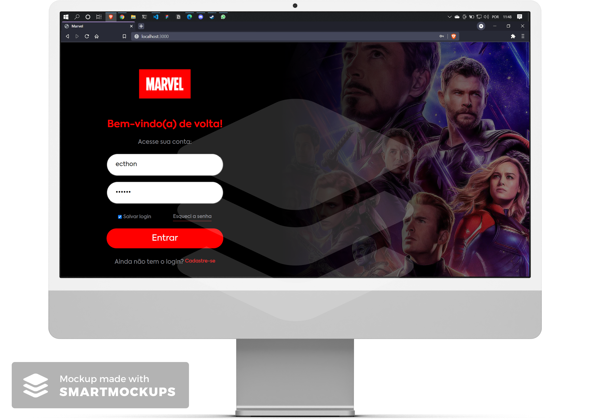

# [Mestres da Web](https://mestresdaweb.com.br/)

## Sobre a empresa

<div>
<p>Desde 2009 vivemos como loucos atrás de mentes apaixonadas por tecnologia, aqueles que nunca ficam contentes com o que sabem, eles sempre querem mais. Somos Beta porque nunca chegamos onde queremos e nunca sabemos o bastante, o conhecimento é nosso alimento, comemos todos os dias.</p>

</div>

## Desafio Front-End Júnior 👨🏽‍💻

<div align="center">

</div>

## 🧬 Executando em sua máquina

```terminal
# Clone este repositório
$ git clone https://github.com/ecthon/front-end-jr-mw.git

# Vá para a pasta do projeto e instale as dependências
$ yarn

# Após instalar as dependências, inicie o projeto
$ yarn start
```

## 🗺 Rotas

- [Login] http://localhost:3000/
- [Home] http://localhost:3000/home
- [Filmes] http://localhost:3000/filmes
- [HQs] http://localhost:3000/hqs

## 🙋🏽‍♂️

Por [ecthon](https://linktr.ee/ecthon) com 💙 e um pouco ☕.
